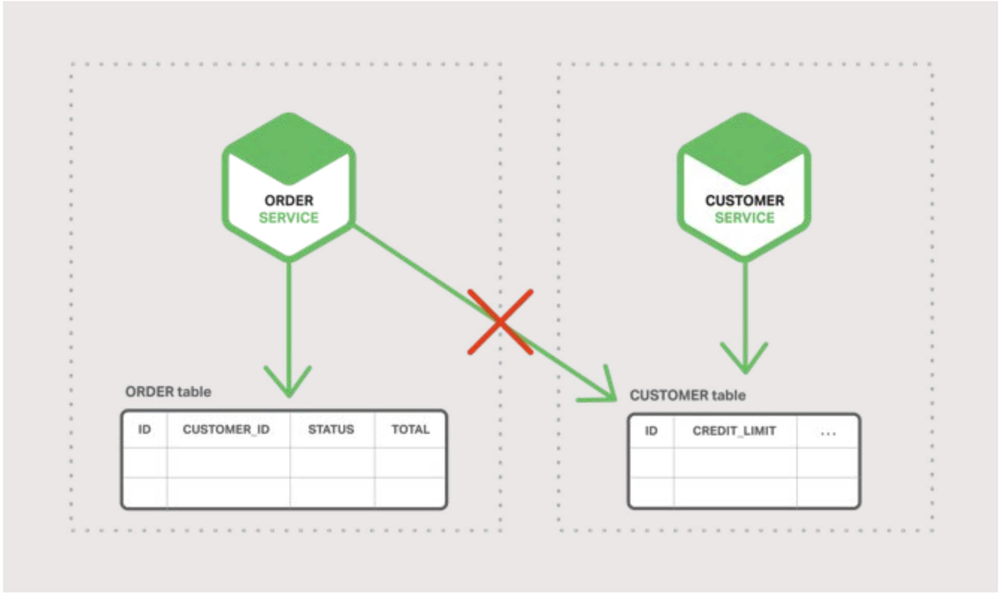
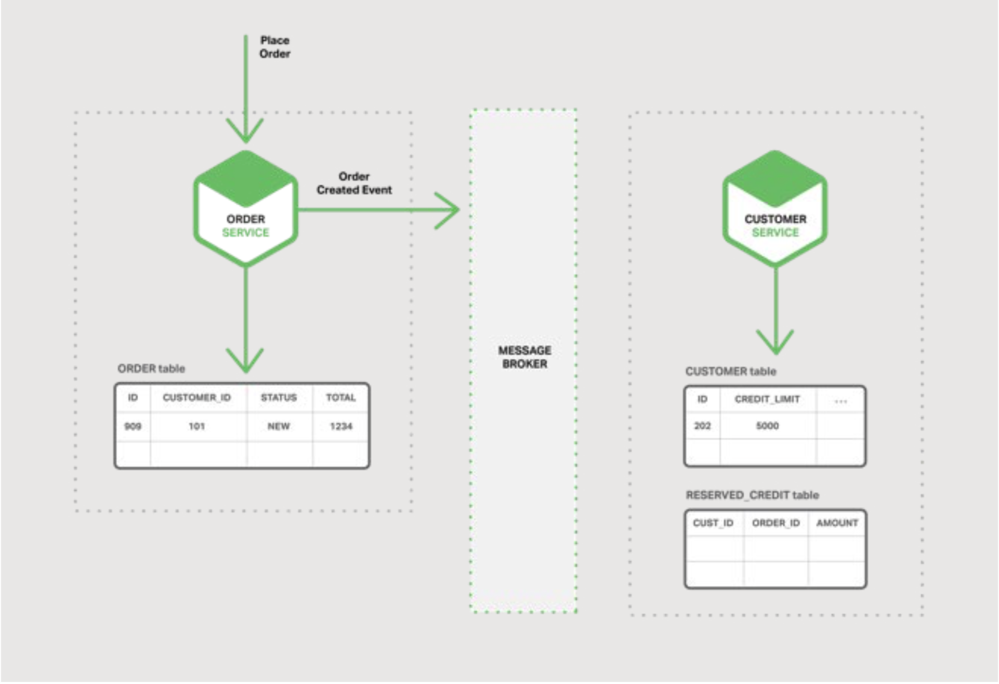
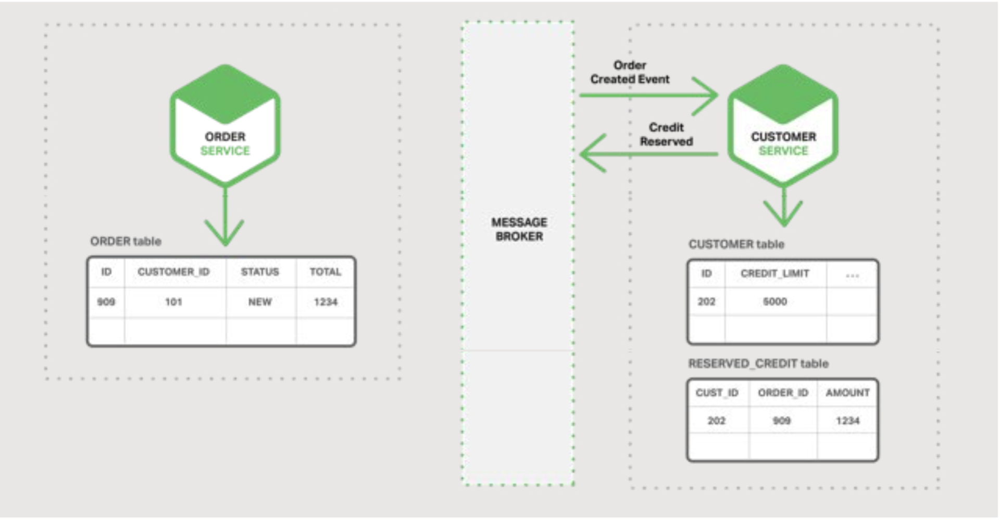

## 微服务的事件驱动数据管理

这是本电子书的第五章，一本关于使用微服务构建应用程序的电子书。章节一介绍了微服务架构模式，讨论了使用微服务的优缺点。章节二和章节三，阐述了微服务之间通信不同的层面。在本章节中，我们探讨与服务发现密切相关的问题。章节四探索了与服务发现紧密相关的问题。在本章节，我们改变话题，探讨微服务架构中出现的分布式数据管理问题。

### 微服务与分布式数据管理问题
巨石应用通常有一个单一的关系型数据库。使用关系型数据库的一个主要好处是能使用ACID事物，提供了一些重要的保障：
- 原子性 - 以原子化方式进行修改
- 一致性 - 数据库的状态永远是一致的
- 隔离性 - 即使事务是并发执行的，它们看起来也是串行执行的
- 持久性 - 事物一旦提交，将无法撤销
  
因此，您的应用程序可以简单地开始事务，更改（插入，更新和删除）多行数据，并提交事务。

使用关系型数据库的另一个主要好处是它提供了SQL，一种丰富的，声明性的，标准化的查询语言。您可以轻松编写一个查询，从多个表中合并数据。然后，RDBMS查询计划程序确定执行查询的最佳方式。您不必担心底层细节，比如如何访问数据库。而且，因为应用的所有数据都是在一个数据库中，所以很容易查询。

不幸的是，当我们转向微服务架构时，数据访问变得更加复杂。这是因为每个微服务拥有的数据对于该微服务是私有的，并且只能通过其API访问。封装数据可确保微服务低耦合，并且相互间可以独立演进。如果多个服务访问相同的数据，则schema修改需要对所有服务进行耗时，协调的更新。

情况更糟的是，不同的微服务通常使用不同种类的数据库。现代应用程序存储和处理各种数据，关系数据库并不总是最佳选择。对于某些用例，特定的NoSQL数据库可能具有更实用的数据模型，并提供更好的性能和可伸缩性。例如，存储和查询文本的服务使用文本搜索引擎（如Elasticsearch）会更合理。同样，存储社交图数据的服务应该使用图形数据库，例如Neo4j，最终，基于微服务的应用通常使用SQL和NoSQL数据库的混合，所谓的混合持久化方案。

用于数据存储的分区的，混合持久化架构具有许多优点，包括服务低耦合，更好的性能与伸缩性。但是，它也带来了分布式数据管理挑战。

第一个挑战是如何实现保持多个服务之间一致性的业务事务。要知道为什么这是一个问题，让我们看一个B2B在线商店的例子。客户服务维护客户信息，包括他们的信用额度。订单服务管理订单，并且必须验证新订单是否违反客户的信用额度。在该应用的巨石版本中，订单服务可以简单的执行一个ACID事务来检查可用额度，然后创建订单。

与此相反，在微服务架构中，ORDER和CUSTOMER表对其各自的服务是私有的，如图5-1所示：

图 5-1 每个微服务拥有自己的数据

订单服务无法直接访问CUSTOMER表。它只能使用客户服务提供的API。订单服务可以潜在的使用分布式事务，也称为两阶段提交(two-phase commit, 2PC)。但是，在现代应用中，2PC通常不是可行的选择。CAP理论需要你在可用性与ACID风格的一致性两者间做出选择，而且可用性通常是更优的选择。此外，很多现代技术，比如大部分NoSQL数据库，不支持2PC。维护服务和数据库之间的数据一致性至关重要，因此我们需要另一种解决方案。

第二个挑战是如何实现从多个服务检索数据的查询。例如，让我们假设应用程序需要显示客户及其最近的订单。如果订单服务提供用于检索客户订单的API，那么您可以使用应用程序端的join来检索此数据。应用程序从客户服务中检索客户，并从订单服务中检索客户的订单。但是，假设订单服务仅支持按主键查找订单（也许它使用的NoSQL数据库只支持基于主键的检索）。在这种情况下，没有明显的方法来检索所需的数据。

### 事件驱动架构
对于许多应用来说，解决方案是使用事件驱动架构。在该架构中，当一些值得注意的事情发生时，微服务就会推送一个事件，不日当他更新了一个业务实体（entity）。其他微服务订阅这些事件。当微服务接收事件时，它可以更新自己的业务实体，这可能导致推送更多事件。

您可以使用事件来实现跨多个服务的业务事务。事物包含一系列步骤。每个步骤由更新业务实体的微服务和发布触发下一步的事件组成。下图显示了在创建订单时如何使用事件驱动方法检查可用信用。

微服务通过消息中间件交换事件：
- 订单服务创建状态为NEW的订单并发布订单创建事件
  
  图 5-2 订单服务推送事件
- 客户服务消费订单创建事件，保留该订单的信用，并发布信用保留事件
  
  图 5-3 客户服务答复
- 订单服务消费信用保留事件并将订单状态更改为OPEN
  
  图 5-4 订单服务响应答复

一个更复杂的场景可能包含额外的步骤，比如在客户信用被检查的同时，预留库存。

假设（a）每个服务以原子方式更新数据库并发布事件 - 稍后再详述 - 以及（b）消息中间件保证事件至少传递一次，然后，您可以实现跨多个服务的业务事务。值得注意的是，这些不是ACID事务。它们提供了许更弱的保证，例如最终一致性。此事务模型称为BASE模型。

您还可以使用事件来维护预加入由物化视图（materialized views），使用由多个微服务拥有的数据。维护视图的服务订阅相关事件并更新视图。图5-5描述了Customer Order View Updater Service 基于Customer Service和Order Service所推送的事件更新Customer Order View。

图 5-5 客户订单视图由两个服务访问。