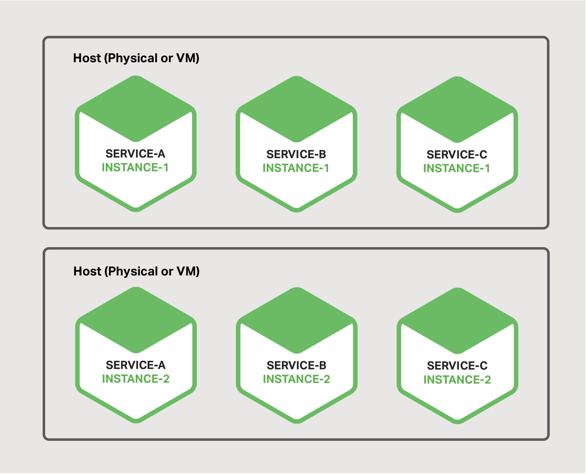

## 微服务部署方案的选择

本章节本电子书的第六章。章节一介绍了微服务架构模式，讨论了使用微服务的优缺点。接下来的章节，讨论了微服务架构图的不同方面：使用API Gateway，进程间通信，服务发现与事件驱动的数据管理。本章节，我们探讨微服务的部署策略。

## 动机
部署巨石应用意味着运行单个（通常是大型）应用的一个或多个相同副本。您通常提供N台服务器(物理或虚拟)，并在每个服务器上运行M个应用实例。单片应用程序的部署并不总是那么简单，但是与微服务应用的部署相比简单的多了。

微服务应用包括是个，甚至上百个服务。服务以各种语言和框架编写。每个都是一个迷你应用程序，具有自己的特定部署，资源，伸缩和监控需求。比如，根据对该服务的需求，你需要运行每个服务的特定数量的实例。同样，必须为每个服务实例提供适当的CPU，内存和I/O资源。更具挑战性的是，尽管存在这种复杂性，但服务部署必须快速，可靠且具有成本效益。

有一些不同的微服务部署模式。首先让我们探讨单主机多服务实例模式。

### 单主机多服务实例模式
部署微服务的一个方式是使用单主机多服务实例模式。使用此模式时，您可以配置一个或多个物理或虚拟主机，并在每个主机上运行多个服务实例。该模式是很多方案中的一种传统的应用部署方案。每个服务实例都在一台或多台主机上的一个众所周知的端口上运行。主机通常像宠物一样被对待。

图6-1：该模式的结构

图6-1 主机支持多服务实例

该模式有许多变种。一种变体是每个服务实例是一个进程或一个进程组。比如，您可以将Java服务实例部署为Apache Tomcat服务器上的web应用程序。一个Node js服务实例可能脑络一个父进程和一个或者多个子进程。

另一个变种是在单个进程或者进程组中运行多个服务实例。比如，你可以在同一个Apache Tomcat服务器上运行多个Java web应用，或者在同一个OSGI容器上运行多个OSGi包。

单主机多服务实例模式同时具有优点和缺点。一个主要有点是资源使用相对高效。多个服务实例共享服务器及其操作系统。 如果进程或组运行多个服务实例，则效率更高，比如，多个web应用共享Apache Tomcat服务器和JVM。

此模式的另一个好处是部署服务实例的速度相对较快。您只需将服务拷贝到主机然后再启动它。如果服务是用Java编写的，则拷贝JAR或WAR文件。对于其他语言，例如Node.js或Ruby，您可以拷贝源代码。在任何一种情况下，通过网络复制的字节数相对较小。

此外，由于缺乏开销，服务动启通常非常快。如果服务运行在自己独立进程，你只需启动它。否则，如果服务是在同一容器进程或进程组中运行的多个实例之一，你要么动态的部署服务到容器中，要么重启容器。

尽管有如此吸引力，该模式仍然有一些显著的缺点。一个主要缺点是服务实例之间很少或没有隔离，除非每一个服务实例是独立的进程。虽然您可以准确地监控每个服务实例的资源利用率，但您无法限制每个实例使用的资源。行为不当的服务实例可能会占用主机的所有内存或CPU。

如果多个服务实例在同一进程中运行，则根本没有隔离。例如，所有实例可能共享相同的JVM堆。行为不当的服务实例可能很容易破坏在同一进程中运行的其他服务。此外，您无法监控每个服务实例使用的资源。

这种方法的另一个重要问题是部署服务的运维团队必须知道如何执行该操作的具体细节。服务可以用各种语言和框架编写，因此开发团队必须与运维团队共享许多细节。这种复杂性增加了部署期间出错的风险。

正如你所看到的，尽管它被大家熟悉，单主机多服务实例模式具有一些显著的缺陷。现在让我们探讨下其他的可以避免该类问题的微服务部署方案。

### 单主机单服务实例模式

部署微服务的另一个方法是单主机单服务实例模式。使用此模式时，可以在其自己的主机上独立运行每个服务实例。此模式有两种不同的特殊化：单虚拟机单服务实例和单容器单服务实例。

#### 单虚拟机单服务实例
当你使用该模式时，您将每个服务打包为虚拟机（VM）镜像，比如Amazon EC2 AMI。每一个服务实例都是使用该虚拟机镜像启动一个虚拟机（比如，EC2实例）。

图6-2：该模式的结构

图6-2 服务可以各自运行在自己的虚拟机中。

这是Netflix用于部署其视频流服务的主要方法。Netflix使用Aminator将其每项服务打包为EC2 AMI。每个运行的服务实例都是EC2实例。您可以使用各种工具来构建自己的VM。 您可以配置持续集成（CI）服务器（例如，Jenkins）以调用Aminator将您的服务打包为EC2 AMI。Packer是自动创建VM镜像的另一种选择。与Aminator不同，它支持各种虚拟化技术，包括EC2，DigitalOcean，VirtualBox和VMware。

Boxfuse公司有一种引人注目的方法来构建VM镜像，它克服了我在下面所描述的虚拟机的缺点。Boxfuse将您的Java应用程序打包为最小的VM镜像。这些镜像构建速度快，启动快，并且由于它们暴露有限的攻击面而更安全。

CloudNative公司拥有Bakery，这是一个用于创建EC2 AMI的SaaS产品。在微服务通过测试后，可以配置CI服务器调用Bakery。然后，Bakery将服务打包为AMI。使用Bakery等SaaS产品意味着你不必浪费宝贵的时间来设置创建AMI的基础架构。

单虚拟机单服务实例有众多优点。VM的主要优点是每个服务实例都完全隔离运行。它具有固定数量的CPU和内存，不能从其他服务中窃取资源。

将微服务部署为虚拟机的另一个好处是可以利用成熟的云基础架构。诸如AWS之类的云提供了有用的特性，比如负载平衡和弹性伸缩。将服务部署为VM的另一个好处是它封装了服务的实现技术。一旦服务被打包为VM，它就变成了黑盒子。VM的管理API成为部署服务的API。部署会变得简单与可靠的多。

但是，单虚拟机单服务实例也有一些缺点。一个缺点是资源利用效率较低。每个服务实例都有整个VM的开销，包括操作系统。此外，在有代表性的公共IaaS中，VM具有固定的大小，并且VM可能未充分利用。

此外，公共IaaS通常对vm的收费，是无论vm是繁忙的还是空闲的。IaaS，比如AWS提供了弹性伸缩，但是很难对需求的变化做出快速反应。最终，你最终不得不过度提供VM，这会增加部署成本。

这种方法的另一个缺点是部署新版本的服务通常很慢。VM镜像通常由于其庞大而构建缓慢。同样，还是用于太过庞大，VM通常实例化过程缓慢。而且，操作系统通常需要一些时间来启动。但请注意，这并非普遍适用，因为存在Boxfuse构建的轻量级VM。

该模式的另一个缺点是你（或者你组织中的其他成员）要负责许多无差别的繁重工作。除非您使用像Boxfuse这样的工具来处理构建和管理VM的开销，否则这是您的责任。这项必要但耗时的活动会分散核心业务。

现在让我们看一下部署微服务的另一种方案，这种方法更轻巧，但仍具有VM的许多优点。

